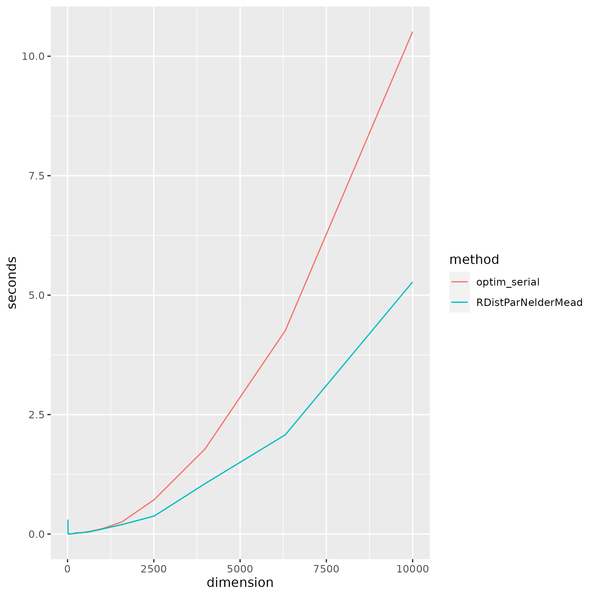
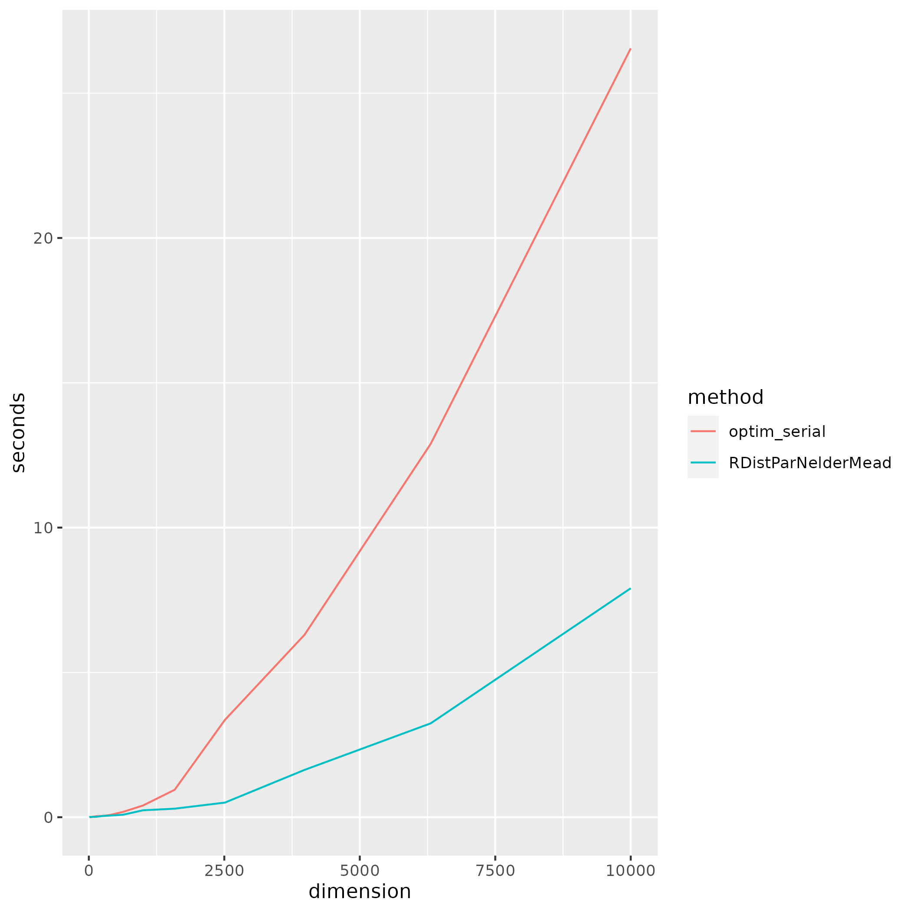

# RDistParNelderMead
MPI-Based Distributed Memory Parallel Nelder-Mead Method for R

## Description
This project brings MPI-Based Distributed Memory Parallel Nelder-Mead Method proposed in Klein and Neira (2014) to R users. The problem this project solves is unconstrained minimization for high-dimensional functions.

## Installation
The current supported operating system is Linux. The Open MPI library is required for the code. If your operating system is Debian or its derivatives, you can install Open MPI library by:
```
sudo apt install libopenmpi-dev
```
Then, you can install devtools library on R if you have not already done so. On Debian or its derivatives, you can run:
```
sudo apt install r-cran-devtools
```
Finally, you can install RDistParNelderMead library on R using devtools:
```
library(devtools)
install_github("chrischeungnf/RDistParNelderMead")
```

## Usage
Wrap your R code which uses RDistParNelderMead library in a file. Then run the file as follows:
```
mpirun -np x Rscript y.R
```
where x is the number of processors you want to use and y.R is your R file.

## Example
### Example 1 (example1.R)
For example, if you want to minimize the following objective function:
$$f_1(x, shift) = \sum_{i=1}^n \frac{(x_i + shift)^2}{n}$$

You can first set up the objective function in R:
```
objFunction1 <- function(points, list_args) {
  shift <- list_args[[1]]
  return(sum((points + shift)^2/length(points)))
}
```

Note that RDistParNelderMead assumes function passed to it have 2 arguments. The first argument accepts a numeric vector while second argument accepts a list of parameters for the function.

Then, you can minimize the function with $shift = 1$, $n = 100$ and initial guess $(1, 1, 1, ..., 1)$ by:
```
library(RDistParNelderMead)
shift <- 1
res <- RDistParNelderMead(rep(1, 100), objFunction1, list(shift))
if(res$rank == 0) {
    print(res)
}
```

After you have used RDistParNelderMead, terminate the MPI execution environment by: 
```
RMPI_Finalize()
```

After that, you can wrap the code in a R script and run it with x processors:
```
mpirun -np x Rscript example1.R
```

Result:
```
$par
  [1] -0.9995026 -0.9995026 -0.9990283 -0.9990283 -0.9990283 -0.9990283
  [7] -1.0046810 -0.9886285 -0.9948785 -1.0003472 -1.0007379 -1.0009332
 [13] -0.9966033 -0.9995026 -0.9995026 -0.9990283 -0.9990283 -0.9990283
 [19] -0.9990283 -1.0047542 -1.0011285 -1.0011285 -1.0011285 -1.0011285
 [25] -1.0011285 -0.9964080 -0.9995026 -0.9995026 -0.9990283 -0.9990283
 [31] -0.9990283 -0.9990283 -1.0047786 -1.0011285 -1.0011285 -1.0011285
 [37] -1.0011285 -1.0011285 -0.9962188 -0.9995026 -0.9995026 -0.9990283
 [43] -0.9990283 -0.9990283 -0.9990283 -1.0047786 -1.0011285 -1.0011285
 [49] -1.0011285 -1.0011285 -1.0011285 -0.9962158 -0.9995026 -0.9995026
 [55] -0.9990283 -0.9990283 -0.9990283 -0.9990283 -1.0047786 -1.0011285
 [61] -1.0011285 -1.0011285 -1.0011285 -1.0011285 -0.9990283 -0.9990283
 [67] -0.9990283 -0.9990283 -0.9990283 -0.9990283 -1.0011285 -1.0011285
 [73] -1.0011285 -1.0011285 -1.0011285 -1.0011285 -0.9990283 -0.9990283
 [79] -0.9990283 -0.9990283 -0.9990283 -0.9990283 -1.0011285 -1.0011285
 [85] -1.0011285 -1.0011285 -1.0011285 -1.0011285 -0.9990283 -0.9990283
 [91] -0.9990283 -0.9990283 -0.9990283 -0.9990283 -1.0011285 -1.0011285
 [97] -1.0011285 -1.0011285 -1.0011285 -1.0011285

$value
[1] 4.099012e-06

$convergence
[1] 0

$rank
[1] 0
```

RDistParNelderMead returns a list containing par (optimal point), value (minimized value), convergence (0 for convergence; 1 for iteration limit has been reached, which indicates optimal point may not be correct) and rank (Processor ID).

### Example 2 (example2.R)
If your objective function does not have parameter like:
$$f_1(x) = \sum_{i=1}^n \frac{x_i^2}{n}$$

Your R function still needs to accept two arguments:
```
objFunction1_nopara <- function(points, list_args) {
  return(sum(points^2/length(points)))
}
```
But, you can minimize the function by:
```
library(RDistParNelderMead)
res <- RDistParNelderMead(rep(1, 100), objFunction1_nopara)
```

Result:
```
$par
  [1] -2.784329e-05 -7.322806e-05 -1.864472e-05 -7.226434e-05 -1.437036e-05
  [6] -2.584871e-05  1.343947e-05  9.465804e-05  6.354349e-05 -3.691190e-05
 [11]  1.266141e-04 -1.644155e-05 -6.569800e-05 -2.784329e-05 -7.322806e-05
 [16] -1.864472e-05 -7.226434e-05 -1.437036e-05 -2.584871e-05  1.343947e-05
 [21]  9.465804e-05  6.354349e-05 -3.691190e-05  1.266141e-04 -1.644155e-05
 [26] -6.569800e-05 -2.784329e-05 -7.322806e-05 -1.864472e-05 -7.226434e-05
 [31] -1.437036e-05 -2.584871e-05  1.343947e-05  9.465804e-05  6.354349e-05
 [36] -3.691190e-05  1.266141e-04 -1.644155e-05 -6.569800e-05 -2.784329e-05
 [41] -7.322806e-05 -1.864472e-05 -7.226434e-05 -1.437036e-05 -2.584871e-05
 [46]  1.343947e-05  9.465804e-05  6.354349e-05 -3.691190e-05  1.266141e-04
 [51] -1.644155e-05 -6.569800e-05 -2.784329e-05 -7.322806e-05 -1.864472e-05
 [56] -7.226434e-05 -1.437036e-05 -2.584871e-05  1.343947e-05  9.465804e-05
 [61]  6.354349e-05 -3.691190e-05  1.266141e-04 -1.644155e-05 -5.054524e-05
 [66] -4.316041e-05 -4.316041e-05  3.416776e-04 -4.894735e-05 -5.365932e-05
 [71] -7.415574e-07  3.050697e-06 -6.836273e-07  4.204247e-05 -3.425323e-06
 [76]  5.582431e-05 -5.054524e-05 -4.316041e-05 -4.316041e-05 -4.894735e-05
 [81] -4.894735e-05 -5.365932e-05 -7.415574e-07  3.050697e-06 -6.836273e-07
 [86]  4.204247e-05 -3.425323e-06  5.582431e-05 -5.054524e-05 -4.316041e-05
 [91] -4.316041e-05 -4.894735e-05 -4.894735e-05 -5.365932e-05 -7.415574e-07
 [96]  3.050697e-06 -6.836273e-07  4.204247e-05 -3.425323e-06  5.582431e-05

$value
[1] 4.053075e-09

$convergence
[1] 0

$rank
[1] 0
```

### Other Examples
For other examples, you can refer to test.R on this repo.

## Comparison with native R optimization routine optim and parallel L-BFGS-B optimParallel
### Test environment
- Computer model: Lenovo ThinkPad L13 Yoga Gen 2a
- Processor: AMD Ryzen™ 7 PRO 5850U, all 8 CPU cores are used in the tests
- Memory: 16 GiB
- Operating system: Ubuntu 22.10

### Correctness (correctness.R)
For the 2 objective functions considered by Lee and Wiswall (2007),
$$f_1(x) = \sum_{i=1}^n \frac{x_i^2}{n}$$
$$f_2(x) = \sum_{i=1}^n \frac{|x_i|}{n}$$
where $n = 100$.

RDistParNelderMead, optim using L-BFGS-B method and optimParallel, which uses L-BFGS-B method parallelly return the correct optimal point - the origin and minimized value 0 while optim using Nelder-Mead method does not:
```
[1] "Test C1 results:"
[1] "=============="
[1] "RDistParNelderMead result:"
$par
  [1] -2.784329e-05 -7.322806e-05 -1.864472e-05 -7.226434e-05 -1.437036e-05
  [6] -2.584871e-05  1.343947e-05  9.465804e-05  6.354349e-05 -3.691190e-05
 [11]  1.266141e-04 -1.644155e-05 -6.569800e-05 -2.784329e-05 -7.322806e-05
 [16] -1.864472e-05 -7.226434e-05 -1.437036e-05 -2.584871e-05  1.343947e-05
 [21]  9.465804e-05  6.354349e-05 -3.691190e-05  1.266141e-04 -1.644155e-05
 [26] -6.569800e-05 -2.784329e-05 -7.322806e-05 -1.864472e-05 -7.226434e-05
 [31] -1.437036e-05 -2.584871e-05  1.343947e-05  9.465804e-05  6.354349e-05
 [36] -3.691190e-05  1.266141e-04 -1.644155e-05 -6.569800e-05 -2.784329e-05
 [41] -7.322806e-05 -1.864472e-05 -7.226434e-05 -1.437036e-05 -2.584871e-05
 [46]  1.343947e-05  9.465804e-05  6.354349e-05 -3.691190e-05  1.266141e-04
 [51] -1.644155e-05 -6.569800e-05 -2.784329e-05 -7.322806e-05 -1.864472e-05
 [56] -7.226434e-05 -1.437036e-05 -2.584871e-05  1.343947e-05  9.465804e-05
 [61]  6.354349e-05 -3.691190e-05  1.266141e-04 -1.644155e-05 -5.054524e-05
 [66] -4.316041e-05 -4.316041e-05  3.416776e-04 -4.894735e-05 -5.365932e-05
 [71] -7.415574e-07  3.050697e-06 -6.836273e-07  4.204247e-05 -3.425323e-06
 [76]  5.582431e-05 -5.054524e-05 -4.316041e-05 -4.316041e-05 -4.894735e-05
 [81] -4.894735e-05 -5.365932e-05 -7.415574e-07  3.050697e-06 -6.836273e-07
 [86]  4.204247e-05 -3.425323e-06  5.582431e-05 -5.054524e-05 -4.316041e-05
 [91] -4.316041e-05 -4.894735e-05 -4.894735e-05 -5.365932e-05 -7.415574e-07
 [96]  3.050697e-06 -6.836273e-07  4.204247e-05 -3.425323e-06  5.582431e-05

$value
[1] 4.053075e-09

$convergence
[1] 0

$rank
[1] 0

Time difference of 0.2411108 secs
[1] "Correct min"
[1] "--------------"
[1] "Nelder-Mead result:"
$par
  [1]  1.3178568  0.8734849  0.8194988  1.6966328  0.7731501  1.6988080
  [7]  1.1784161  1.4737696  0.9446966  1.1342747  1.3968793  1.2959658
 [13]  0.9702676  0.7322695  0.7395739  1.2568080  0.5502206  1.4664543
 [19]  0.8549690  1.2957978  0.8813110  1.2927533  0.7635496  1.0374086
 [25]  0.6347662  1.5465228  1.3792925  1.2128764  0.6622207  1.0552598
 [31]  0.2370512  0.6670424  0.6290771  1.0782933  0.5667594  0.8740070
 [37]  0.4372285  0.7089607  0.4105869  0.4151720  0.5044324  0.7792932
 [43]  0.5384071  0.5115392  0.6522232  0.6301745  0.8865311  0.8350147
 [49]  1.1359174  0.5044640  0.9711842  1.0947375  1.1387510  0.5046119
 [55]  0.6465531  1.0357414  0.7793932  0.3026228  0.7662012  0.6548509
 [61]  1.2199266  1.0202098  0.4930433  1.4941026  0.7882345  0.9934177
 [67]  0.7309200  0.4475668  0.5498521  0.3895417  0.7559090  0.6167433
 [73]  0.3204351  0.6736211  0.8931537  0.5809988  0.4092225  0.9395604
 [79]  0.1373323  0.6596401  0.2787677  0.3715393  1.0900008  0.0503096
 [85]  1.0477513 -0.1438614  0.8623608  0.9962936  0.7116262  0.8491994
 [91]  0.4724771  0.2409795  1.0626575  0.6153771  0.8293161  0.6393260
 [97]  0.9552772  0.8234158  0.3472523  0.8539158

$value
[1] 0.7830474

$counts
function gradient 
  390255       NA 

$convergence
[1] 0

$message
NULL

Time difference of 3.050253 secs
[1] "Incorrect min"
[1] "--------------"
[1] "L-BFGS-B result:"
$par
  [1] -3.771946e-21 -3.771946e-21 -3.771946e-21 -3.771946e-21 -3.771946e-21
  [6] -3.771946e-21 -3.771946e-21 -3.771946e-21 -3.771946e-21 -3.771946e-21
 [11] -3.771946e-21 -3.771946e-21 -3.771946e-21 -3.771946e-21 -3.771946e-21
 [16] -3.771946e-21 -3.771946e-21 -3.771946e-21 -3.771946e-21 -3.771946e-21
 [21] -3.771946e-21 -3.771946e-21 -3.771946e-21 -3.771946e-21 -3.771946e-21
 [26] -3.771946e-21 -3.771946e-21 -3.771946e-21 -3.771946e-21 -3.771946e-21
 [31] -3.771946e-21 -3.771946e-21 -3.771946e-21 -3.771946e-21 -3.771946e-21
 [36] -3.771946e-21 -3.771946e-21 -3.771946e-21 -3.771946e-21 -3.771946e-21
 [41] -3.771946e-21 -3.771946e-21 -3.771946e-21 -3.771946e-21 -3.771946e-21
 [46] -3.771946e-21 -3.771946e-21 -3.771946e-21 -3.771946e-21 -3.771946e-21
 [51] -3.771946e-21 -3.771946e-21 -3.771946e-21 -3.771946e-21 -3.771946e-21
 [56] -3.771946e-21 -3.771946e-21 -3.771946e-21 -3.771946e-21 -3.771946e-21
 [61] -3.771946e-21 -3.771946e-21 -3.771946e-21 -3.771946e-21 -3.771946e-21
 [66] -3.771946e-21 -3.771946e-21 -3.771946e-21 -3.771946e-21 -3.771946e-21
 [71] -3.771946e-21 -3.771946e-21 -3.771946e-21 -3.771946e-21 -3.771946e-21
 [76] -3.771946e-21 -3.771946e-21 -3.771946e-21 -3.771946e-21 -3.771946e-21
 [81] -3.771946e-21 -3.771946e-21 -3.771946e-21 -3.771946e-21 -3.771946e-21
 [86] -3.771946e-21 -3.771946e-21 -3.771946e-21 -3.771946e-21 -3.771946e-21
 [91] -3.771946e-21 -3.771946e-21 -3.771946e-21 -3.771946e-21 -3.771946e-21
 [96] -3.771946e-21 -3.771946e-21 -3.771946e-21 -3.771946e-21 -3.771946e-21

$value
[1] 1.422758e-41

$counts
function gradient 
       4        4 

$convergence
[1] 0

$message
[1] "CONVERGENCE: NORM OF PROJECTED GRADIENT <= PGTOL"

Time difference of 0.002375603 secs
[1] "Correct min"
[1] "--------------"
[1] "parallel-L-BFGS-B result:"
$par
  [1] -3.771946e-21 -3.771946e-21 -3.771946e-21 -3.771946e-21 -3.771946e-21
  [6] -3.771946e-21 -3.771946e-21 -3.771946e-21 -3.771946e-21 -3.771946e-21
 [11] -3.771946e-21 -3.771946e-21 -3.771946e-21 -3.771946e-21 -3.771946e-21
 [16] -3.771946e-21 -3.771946e-21 -3.771946e-21 -3.771946e-21 -3.771946e-21
 [21] -3.771946e-21 -3.771946e-21 -3.771946e-21 -3.771946e-21 -3.771946e-21
 [26] -3.771946e-21 -3.771946e-21 -3.771946e-21 -3.771946e-21 -3.771946e-21
 [31] -3.771946e-21 -3.771946e-21 -3.771946e-21 -3.771946e-21 -3.771946e-21
 [36] -3.771946e-21 -3.771946e-21 -3.771946e-21 -3.771946e-21 -3.771946e-21
 [41] -3.771946e-21 -3.771946e-21 -3.771946e-21 -3.771946e-21 -3.771946e-21
 [46] -3.771946e-21 -3.771946e-21 -3.771946e-21 -3.771946e-21 -3.771946e-21
 [51] -3.771946e-21 -3.771946e-21 -3.771946e-21 -3.771946e-21 -3.771946e-21
 [56] -3.771946e-21 -3.771946e-21 -3.771946e-21 -3.771946e-21 -3.771946e-21
 [61] -3.771946e-21 -3.771946e-21 -3.771946e-21 -3.771946e-21 -3.771946e-21
 [66] -3.771946e-21 -3.771946e-21 -3.771946e-21 -3.771946e-21 -3.771946e-21
 [71] -3.771946e-21 -3.771946e-21 -3.771946e-21 -3.771946e-21 -3.771946e-21
 [76] -3.771946e-21 -3.771946e-21 -3.771946e-21 -3.771946e-21 -3.771946e-21
 [81] -3.771946e-21 -3.771946e-21 -3.771946e-21 -3.771946e-21 -3.771946e-21
 [86] -3.771946e-21 -3.771946e-21 -3.771946e-21 -3.771946e-21 -3.771946e-21
 [91] -3.771946e-21 -3.771946e-21 -3.771946e-21 -3.771946e-21 -3.771946e-21
 [96] -3.771946e-21 -3.771946e-21 -3.771946e-21 -3.771946e-21 -3.771946e-21

$value
[1] 1.422758e-41

$counts
function gradient 
       4        4 

$convergence
[1] 0

$message
[1] "CONVERGENCE: NORM OF PROJECTED GRADIENT <= PGTOL"

Time difference of 0.4817312 secs
[1] "Correct min"
[1] "--------------"
[1] "Test C2 results:"
[1] "=============="
[1] "RDistParNelderMead result:"
$par
  [1]  4.263410e-08  1.423657e-07  8.636956e-06 -7.904838e-07  4.169210e-06
  [6]  3.382299e-06 -9.911980e-06 -1.624570e-05  2.748474e-06  2.951469e-05
 [11]  1.585593e-05 -1.033825e-05  4.490815e-07  5.403810e-08  5.326482e-07
 [16]  8.163553e-06 -2.765036e-07  4.748967e-06  3.848156e-06 -1.368553e-06
 [21] -1.633693e-05  1.045505e-05  1.000609e-05  1.085118e-05 -1.280585e-05
 [26]  4.490815e-07  5.403810e-08  5.326482e-07  8.163553e-06 -2.765036e-07
 [31]  4.748967e-06  3.848156e-06 -1.368553e-06 -1.633693e-05  1.045505e-05
 [36]  1.000609e-05  1.085118e-05 -1.280585e-05  4.490815e-07  5.403810e-08
 [41]  5.326482e-07  8.163553e-06 -2.765036e-07  4.748967e-06  3.848156e-06
 [46] -1.368553e-06 -1.633693e-05  1.045505e-05  1.000609e-05  1.085118e-05
 [51] -1.280585e-05  4.490815e-07  5.403810e-08  5.326482e-07  8.163553e-06
 [56] -2.765036e-07  4.748967e-06  3.848156e-06 -1.368553e-06 -1.633693e-05
 [61]  1.045505e-05  1.000609e-05  1.085118e-05 -1.280585e-05  1.474615e-07
 [66] -1.545754e-06 -7.524331e-07 -1.613301e-06 -1.658820e-06 -1.134310e-05
 [71]  2.697706e-06  1.501456e-06  2.030949e-06 -9.578814e-07 -2.224406e-06
 [76] -2.193355e-06  1.474615e-07 -1.545754e-06 -7.524331e-07 -1.613301e-06
 [81] -1.658820e-06  8.639344e-07  2.697706e-06  1.501456e-06  2.030949e-06
 [86] -9.578814e-07 -2.224406e-06 -2.193355e-06  1.474615e-07 -1.545754e-06
 [91] -7.524331e-07 -1.613301e-06 -1.658820e-06  8.639344e-07  2.697706e-06
 [96]  1.501456e-06  2.030949e-06 -9.578814e-07 -2.224406e-06 -2.193355e-06

$value
[1] 4.864069e-06

$convergence
[1] 0

$rank
[1] 0

Time difference of 0.02389073 secs
[1] "Correct min"
[1] "--------------"
[1] "Nelder-Mead result:"
$par
  [1]  9.884112e-01  5.212377e-01  5.850808e-01  1.975088e+00  7.117227e-01
  [6]  2.133250e-01  6.545794e-01  2.058779e+00  1.742749e+00  1.038719e+00
 [11]  1.135024e+00  1.081773e+00  1.129471e+00  1.444692e+00  4.342051e-02
 [16]  2.026753e+00  1.633469e+00  9.065373e-01  1.185359e+00  1.063920e+00
 [21]  5.948212e-03  3.241422e+00  5.527164e-01  1.296992e+00  2.527536e-01
 [26]  2.759797e-01 -2.239618e-04  7.683616e-01  9.450591e-01  2.731958e+00
 [31]  1.494880e-02  8.097150e-01  6.497529e-01  9.936522e-01  6.620021e-01
 [36]  6.900570e-01  2.474041e-02  1.135037e+00  1.016271e+00  3.106822e+00
 [41]  1.871760e-01  5.864228e-02  2.501340e+00  5.126344e-04  2.168474e+00
 [46]  1.699760e+00  1.046579e+00  1.713849e-01  1.117478e+00  1.313697e+00
 [51]  3.096151e+00  6.005962e-01  1.192570e-01  1.677934e+00  1.417813e+00
 [56]  7.525784e-01  7.791106e-01  5.584894e-02 -1.861520e-07  6.022361e-01
 [61]  1.391442e+00  1.784885e+00  5.248987e-01  6.934681e-01  1.011852e+00
 [66]  1.089462e+00  1.060572e+00  1.037401e+00  5.765816e-01  1.160490e+00
 [71]  6.083394e-01  3.870674e-01  6.905195e-03  5.544577e-01  5.096223e-01
 [76]  2.484134e-01  7.347072e-01  1.019345e-02  1.481247e+00  2.119470e-01
 [81] -6.081944e-03  2.612029e-01  2.886954e-01  4.732629e-01  3.281158e-02
 [86]  1.920045e+00  3.879114e-03  6.149370e-01 -3.184652e-07  1.518011e+00
 [91]  1.361424e+00  1.086631e+00 -4.885262e-03  1.658969e+00  1.330951e+00
 [96]  8.778497e-02  2.266257e+00  2.816895e+00  2.738509e+00  1.081213e-02

$value
[1] 0.9424709

$counts
function gradient 
  122029       NA 

$convergence
[1] 0

$message
NULL

Time difference of 1.375756 secs
[1] "Incorrect min"
[1] "--------------"
[1] "L-BFGS-B result:"
$par
  [1] 1.270549e-20 1.270549e-20 1.270549e-20 1.270549e-20 1.270549e-20
  [6] 1.270549e-20 1.270549e-20 1.270549e-20 1.270549e-20 1.270549e-20
 [11] 1.270549e-20 1.270549e-20 1.270549e-20 1.270549e-20 1.270549e-20
 [16] 1.270549e-20 1.270549e-20 1.270549e-20 1.270549e-20 1.270549e-20
 [21] 1.270549e-20 1.270549e-20 1.270549e-20 1.270549e-20 1.270549e-20
 [26] 1.270549e-20 1.270549e-20 1.270549e-20 1.270549e-20 1.270549e-20
 [31] 1.270549e-20 1.270549e-20 1.270549e-20 1.270549e-20 1.270549e-20
 [36] 1.270549e-20 1.270549e-20 1.270549e-20 1.270549e-20 1.270549e-20
 [41] 1.270549e-20 1.270549e-20 1.270549e-20 1.270549e-20 1.270549e-20
 [46] 1.270549e-20 1.270549e-20 1.270549e-20 1.270549e-20 1.270549e-20
 [51] 1.270549e-20 1.270549e-20 1.270549e-20 1.270549e-20 1.270549e-20
 [56] 1.270549e-20 1.270549e-20 1.270549e-20 1.270549e-20 1.270549e-20
 [61] 1.270549e-20 1.270549e-20 1.270549e-20 1.270549e-20 1.270549e-20
 [66] 1.270549e-20 1.270549e-20 1.270549e-20 1.270549e-20 1.270549e-20
 [71] 1.270549e-20 1.270549e-20 1.270549e-20 1.270549e-20 1.270549e-20
 [76] 1.270549e-20 1.270549e-20 1.270549e-20 1.270549e-20 1.270549e-20
 [81] 1.270549e-20 1.270549e-20 1.270549e-20 1.270549e-20 1.270549e-20
 [86] 1.270549e-20 1.270549e-20 1.270549e-20 1.270549e-20 1.270549e-20
 [91] 1.270549e-20 1.270549e-20 1.270549e-20 1.270549e-20 1.270549e-20
 [96] 1.270549e-20 1.270549e-20 1.270549e-20 1.270549e-20 1.270549e-20

$value
[1] 1.270549e-20

$counts
function gradient 
      39       39 

$convergence
[1] 0

$message
[1] "CONVERGENCE: NORM OF PROJECTED GRADIENT <= PGTOL"

Time difference of 0.0344398 secs
[1] "Correct min"
[1] "--------------"
[1] "parallel-L-BFGS-B result:"
$par
  [1] 1.270549e-20 1.270549e-20 1.270549e-20 1.270549e-20 1.270549e-20
  [6] 1.270549e-20 1.270549e-20 1.270549e-20 1.270549e-20 1.270549e-20
 [11] 1.270549e-20 1.270549e-20 1.270549e-20 1.270549e-20 1.270549e-20
 [16] 1.270549e-20 1.270549e-20 1.270549e-20 1.270549e-20 1.270549e-20
 [21] 1.270549e-20 1.270549e-20 1.270549e-20 1.270549e-20 1.270549e-20
 [26] 1.270549e-20 1.270549e-20 1.270549e-20 1.270549e-20 1.270549e-20
 [31] 1.270549e-20 1.270549e-20 1.270549e-20 1.270549e-20 1.270549e-20
 [36] 1.270549e-20 1.270549e-20 1.270549e-20 1.270549e-20 1.270549e-20
 [41] 1.270549e-20 1.270549e-20 1.270549e-20 1.270549e-20 1.270549e-20
 [46] 1.270549e-20 1.270549e-20 1.270549e-20 1.270549e-20 1.270549e-20
 [51] 1.270549e-20 1.270549e-20 1.270549e-20 1.270549e-20 1.270549e-20
 [56] 1.270549e-20 1.270549e-20 1.270549e-20 1.270549e-20 1.270549e-20
 [61] 1.270549e-20 1.270549e-20 1.270549e-20 1.270549e-20 1.270549e-20
 [66] 1.270549e-20 1.270549e-20 1.270549e-20 1.270549e-20 1.270549e-20
 [71] 1.270549e-20 1.270549e-20 1.270549e-20 1.270549e-20 1.270549e-20
 [76] 1.270549e-20 1.270549e-20 1.270549e-20 1.270549e-20 1.270549e-20
 [81] 1.270549e-20 1.270549e-20 1.270549e-20 1.270549e-20 1.270549e-20
 [86] 1.270549e-20 1.270549e-20 1.270549e-20 1.270549e-20 1.270549e-20
 [91] 1.270549e-20 1.270549e-20 1.270549e-20 1.270549e-20 1.270549e-20
 [96] 1.270549e-20 1.270549e-20 1.270549e-20 1.270549e-20 1.270549e-20

$value
[1] 1.270549e-20

$counts
function gradient 
      39       39 

$convergence
[1] 0

$message
[1] "CONVERGENCE: NORM OF PROJECTED GRADIENT <= PGTOL"

Time difference of 4.442035 secs
[1] "Correct min"
[1] "--------------"
```

#### Memory (memory.R)
When increasing n to be 10000, both RDistParNelderMead and optim using L-BFGS-B method are successful to minimize $f_1$. However, optimParallel fails to do so as the process is killed by the Linux Out of Memory killer:
```
[1] "RDistParNelderMead:"
[1] 4.314222e-10
[1] "optim using L-BFGS-B, serial:"
[1] 3.060663e-38
[1] "optim using L-BFGS-B, parallel:"
--------------------------------------------------------------------------
Primary job  terminated normally, but 1 process returned
a non-zero exit code. Per user-direction, the job has been aborted.
--------------------------------------------------------------------------
--------------------------------------------------------------------------
mpirun noticed that process rank 0 with PID 0 on node cheung-ThinkPad-L13-Yoga-Gen-2a exited on signal 9 (Killed).
--------------------------------------------------------------------------
```

### Speed (speed.R)
As optim using Nelder-Mead method produces incorrect result and optimParallel uses too much memory for our problems, we only compare the speed (in seconds) of RDistParNelderMead and optim using L-BFGS-B method:
```
[1] "Test S1 results:"
[1] "=============="
   dimension RDistParNelderMead optim_serial RDistParNelderMead_best
1         10        0.302337885 2.431870e-04                   FALSE
2         15        0.004471064 2.741814e-04                   FALSE
3         25        0.001262903 5.056858e-04                   FALSE
4         39        0.002135038 7.820129e-04                   FALSE
5         63        0.002701044 1.152754e-03                   FALSE
6        100        0.005305767 1.939297e-03                   FALSE
7        158        0.008138180 7.720232e-03                   FALSE
8        251        0.025610209 1.394916e-02                   FALSE
9        398        0.028073311 2.651310e-02                   FALSE
10       630        0.045825481 5.385232e-02                    TRUE
11      1000        0.104092598 1.102014e-01                    TRUE
12      1584        0.199268103 2.570872e-01                    TRUE
13      2511        0.376429081 7.202151e-01                    TRUE
14      3981        1.053388596 1.778351e+00                    TRUE
15      6309        2.076748133 4.256848e+00                    TRUE
16     10000        5.277940273 1.051560e+01                    TRUE
```


```
[1] "Test S2 results:"
[1] "=============="
   dimension RDistParNelderMead optim_serial RDistParNelderMead_best
1         10        0.005705833 7.736683e-04                   FALSE
2         15        0.007436514 2.166748e-03                   FALSE
3         25        0.007132530 7.488728e-04                   FALSE
4         39        0.005583286 3.057480e-03                   FALSE
5         63        0.012339592 9.839773e-03                   FALSE
6        100        0.009519339 2.588105e-02                    TRUE
7        158        0.017817020 3.871775e-02                    TRUE
8        251        0.042252302 4.243755e-02                    TRUE
9        398        0.055920124 7.964516e-02                    TRUE
10       630        0.084881067 1.826594e-01                    TRUE
11      1000        0.238809824 4.042814e-01                    TRUE
12      1584        0.294316530 9.479792e-01                    TRUE
13      2511        0.504652739 3.359383e+00                    TRUE
14      3981        1.633769751 6.300533e+00                    TRUE
15      6309        3.241330385 1.289312e+01                    TRUE
16     10000        7.905520439 2.654753e+01                    TRUE
```


As expected, RDistParNelderMead is slower than optim using L-BFGS-B method for low-dimensional functions due to communication overhead between processors. But, RDistParNelderMead is much faster than optim using L-BFGS-B method when dimension of the function is high enough.

## Acknowledgement
I highly appreciate permission from [Prof. Neira](https://sites.google.com/site/julianneira/) to modify the C++ code of his paper with Kyle Klein available at <https://www.dropbox.com/s/z8gpwkszy0u5wz6/Klein_Neira_code.zip>.

## Citation
Klein, K., and J. Neira (2014). Nelder-Mead Simplex Optimization Routine for Large-Scale Problems: A Distributed Memory Implementation. *Computational Economics, 43*(4), 447–461. <https://doi.org/10.1007/s10614-013-9377-8>

Lee, D., and M. Wiswall (2007). A parallel implementation of the simplex function minimization routine. *Computational Economics, 30*(2), 171–187. <https://doi.org/10.1007/s10614-007-9094-2>

